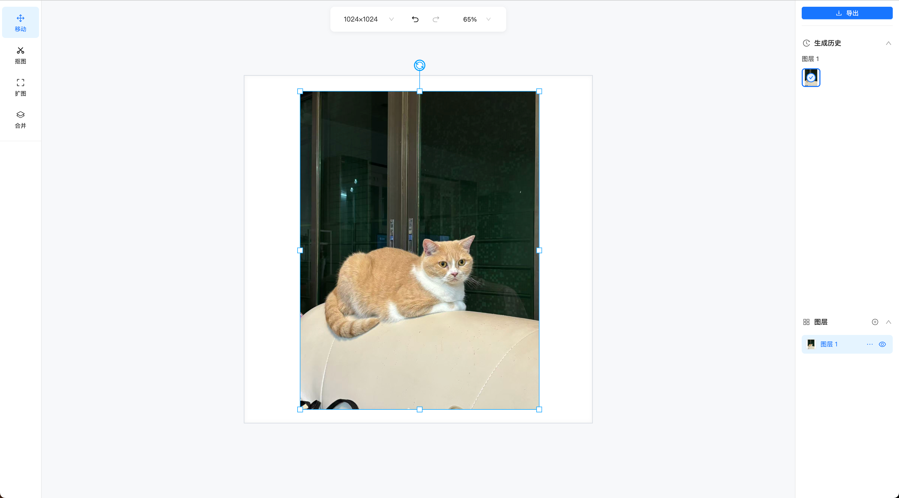

# Konva Layer Editor

<p align="center">
  <strong>🎨 基于 Konva.js 和 React 的现代化强大图层编辑器</strong>
</p>

<p align="center">
  
</p>

<p align="center">
  <a href="#-功能特性">功能特性</a> •
  <a href="#-快速开始">快速开始</a> •
  <a href="#-使用说明">使用说明</a> •
  <a href="#-快捷键">快捷键</a> •
  <a href="#-技术栈">技术栈</a> •
  <a href="#-项目结构">项目结构</a> •
  <a href="#-许可证">许可证</a>
</p>

---

## ✨ 功能特性

### 🖼️ 图层管理
- **多图层处理** - 支持同时上传与编辑多个图片图层
- **拖拽排序** - 基于 dnd-kit 的直观图层上下层级拖拽调整
- **显示/隐藏** - 一键切换单个或多个图层可见性
- **多选操作** - 支持 `Shift + 点击` / `Cmd/Ctrl + 点击` 进行多图层批量操作
- **复制粘贴** - 快捷键快速复制粘贴选中图层 (`Cmd/Ctrl + C` / `Cmd/Ctrl + V`)

### 🎯 变换与裁剪
- **自由变换** - 拖拽 8 个控制锚点进行平移、等比缩放、旋转
- **边框裁剪** - 拖拽四边控制锚点直接裁剪图片可视区域，自动保持原图比例尺与边界保护
- **防翻转与边界保护** - 智能限制最小尺寸与画布安全边界，避免意外翻转变形
- **适应画布** - 自动缩放图层以最佳比例适应画布视口

### 💬 大模型对话修改图片 (AI Image Edit)
- **自然语言修改** - 选中图层后输入 Prompt 描述，让大模型（如 `Qwen-Image-Edit`）自动修改图层画面
- **快捷交互** - 现代磨砂质感对话输入面板，支持 `Cmd/Ctrl + Enter` 一键极速发送
- **可视化模型配置** - 输入框顶部突出 Tab 式配置入口，支持在页面上自定义 **API Base URL**、**API Key / Access Token** 和 **Model 名称**，数据本地持久化存储
- **安全跨域代理** - 内置本地 API 转发中间件与图片代理，彻底解决浏览器端 CORS 跨域拦截与 Canvas 图片污染问题

### ✂️ 抠图与扩展
- **画笔工具** - 可调节大小的画笔自由绘制选区蒙版
- **橡皮擦** - 精细擦除与修正蒙版区域
- **反选与羽化** - 一键反转选区，快速提取主体并生成独立图层
- **图层合并** - 支持将多个选中图层直接合并为一个全新图层

### 💾 工程导入与导出 (JSON)
- **整套工程导出** - 一键将当前画布尺寸、所有图层变换参数（位置/缩放/旋转/裁剪/原始比例尺寸）与历史记录打包导出为 `.json` 工程文件
- **自包含离线还原** - 自动转换为自包含格式，脱离当前会话在任意设备上导入均能 100% 完整无损还原
- **左下角快捷操作** - 位于左侧侧边栏底部，随时导入/导出工程数据

### 📤 图片导出功能
- **单层导出** - 将选中图层单独导出为 PNG / JPG
- **批量导出** - 将所有图层一键打包为 ZIP 压缩包下载
- **画布整图导出** - 直接将当前完整画布渲染导出为高清图片

### 🔄 历史记录与视图控制
- **撤销/重做** - 完整的图层状态历史栈追踪 (`Cmd/Ctrl + Z` / `Cmd + Shift + Z`)
- **生成历史** - 支持回溯图层的历史衍生版本
- **平移与缩放** - 支持滚轮平移、手势缩放、预设缩放比与一键全览适配

---

## 🚀 快速开始

```bash
# 克隆仓库
git clone https://github.com/Coomfu/konva-layer-editor.git

# 进入项目目录
cd konva-layer-editor

# 安装依赖
pnpm install
# 或 npm install

# 启动开发服务器
pnpm dev
# 或 npm run dev
```

---

## 💻 使用说明

1. **添加图片** - 点击右侧图层面板的「添加图片」或拖拽图片到画布
2. **选择与变换** - 点击画布图层或右侧列表项选中图层，使用控制锚点进行移动、缩放、裁剪或旋转
3. **AI 对话修改** - 左侧切换到「对话」工具，在底部输入提示词修改图层（右上角 Tab 可配置 API Token）
4. **抠图/合并** - 使用左侧「抠图」工具涂抹选区提取图层，或使用「合并」功能将多个图层压合
5. **工程保存与导出** - 点击左下角「导出」保存整套工程 JSON，或右上角「导出图片」下载图片

---

## ⌨️ 快捷键

| 快捷键 | 功能操作 |
|---|---|
| `Cmd / Ctrl + C` | 复制选中图层 |
| `Cmd / Ctrl + V` | 粘贴图层 |
| `Cmd / Ctrl + Z` | 撤销上一步操作 |
| `Cmd + Shift + Z` / `Ctrl + Alt + Z` | 重做下一步操作 |
| `Delete` / `Backspace` | 删除选中图层 |
| `Cmd / Ctrl + Enter` | 对话面板快速发送修改请求 |
| `Shift + 鼠标点击` | 连续多选图层 |
| `鼠标滚轮` | 画布上下平移 |
| `Ctrl + 滚轮` / `触摸板双指捏合` | 画布平滑缩放 |

---

## 🛠️ 技术栈

| 类别 | 技术方案 |
|---|---|
| **核心框架** | React 18 |
| **画布渲染引擎** | Konva.js (`react-konva`) |
| **UI 组件库** | Ant Design 5 + `@ant-design/icons` |
| **状态管理** | React Context + 自定义 Hooks 体系 |
| **拖拽排序** | `@dnd-kit/core` + `@dnd-kit/sortable` |
| **打包与代理工具** | Vite 5 (含原生 API/图片 CORS 代理中间件) |
| **开发语言** | TypeScript |
| **样式方案** | SCSS |

---

## 📁 项目结构

```
src/
├── components/
│   ├── ControlBar/       # 底部/顶部控制栏（缩放、视图控制、对话气泡样式）
│   ├── Panel/            # 右侧面板（图层列表、图层排序、生成历史、图片导出）
│   ├── SizePanel/        # 尺寸预设与画布比例控制面板
│   ├── SubToolBar/       # 二级工具栏（AI 对话面板 DialogPanel、抠图/扩图/合并工具）
│   ├── ToolBar/          # 左侧主工具栏（移动/抠图/扩图/合并/对话、左下角工程导入导出）
│   ├── LayerImage.tsx    # 单个图层 Konva 节点渲染与裁剪控制
│   ├── Transformer.tsx   # 变换控制点、旋转手柄与边界限制
│   └── Viewport.tsx      # 主画布视窗与平移缩放交互
├── hooks/
│   ├── useCachedImage.ts     # 图片资源缓存池与异步预加载管理
│   ├── useDrawingCanvas.ts   # 抠图涂抹与蒙版 Canvas 控制
│   ├── useEditor.ts          # 编辑器顶层状态聚合与入口 Hook
│   ├── useHistoryManager.ts  # 操作历史记录与撤销重做管理
│   ├── useLayerManger.ts     # 图层增删改查、排序与选中状态管理
│   ├── useKeyManager.ts      # 全局快捷键监听与注册
│   └── useZoom.ts            # 画布视口缩放与平移对齐算法
├── services/
│   └── imageEdit.ts      # 大模型原生 fetch 通信、任务轮询与本地配置持久化
├── context/              # 全局 EditorContext 共享状态
├── type/                 # TypeScript 类型定义
└── utils/
    ├── canvas.ts         # Canvas 图片裁剪、压缩与导出工具函数
    ├── project.ts        # 整套系统工程数据导入导出序列化算法
    └── utils.ts          # 几何变换、旋转计算与图层辅助函数
```

---

## 📄 许可证

本项目采用 MIT 许可证 - 详见 [LICENSE](LICENSE) 文件
